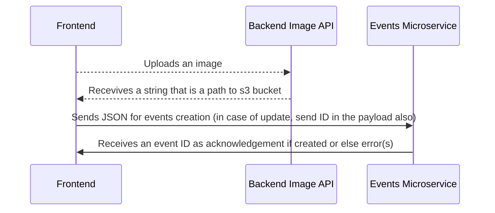

# Creating events

Overall key names, data types, description and examples
 
| Key name | Data type | Description | Example |
|--|--|--|--|
| images | array | Set of image names with path example | [/{user_id}/{yyyy}/{mm}/{dd}/{filename}.{extension}] |
default_image | integer | array index | 0 
title | string | title of the event | Cat grooming sessions
description | string | description of the event | How to groom your cat efficiently
activity_owner | string | user_id | user_id
activity_audience_category | array | the active audience category types | [10,12,13]
start_time | integer | UTC Epoch | 1675099193000
duration | integer | duration in millisecond | 36000
frequency | string | valid cron cycle | 5 * * * * 
end_date | integer | end date if frequency is set | 1675099193000 
location | object | lat and long object | {lat: 10.0, lng: 20.0}
geolocated_address | string | geolocated address from the google APIs | b402, Neel Sidhi Ornate, Kharghar, Mumbai
payment_type | integer | payment type of the activity if the activity is paid or else unpaid | set 0 if the payment type is 0 or else 1
capacity | integer | number of people allowed to attend | -1 if it has no cap on capacity, else specific integer value
type | array | set the type and price of the audience, max 4. price in cents and not in dollars | [{tpye: "adult", price: 1500}] 
is_children_activity | boolean | is this activity a children's activity? | true
is_pet_friendly | boolean | is this activity a pet-friendly activity? | false
is_disability_support | boolean | is this activity supports disability? | false

___

# JSON 
`Activity creation JSON`

    {
		images: ["10/2023/01/30/a.jpg", "10/2023/01/30/b.jpg"],
		default_image: 1,
		title: "Cat grooming sessions",
		activity_audience_category: [10,12,13,14],
		description: "How to groom your cat efficiently",
		start_time: 1675099193000,
		duration: 36000,
		frequency: "5 * * * *",
		end_date: 1675099193000,
		location: {lat: 10.0, lng: 20.0},
		geolocated_address: "b402, Neel Sidhi Ornate, Kharghar, Mumbai",
		payment_type: 0,
		capacity: -1,
		type: [{tpye: “adult”, price: 1500}],
		is_children_activity: false,
		is_pet_friendly: true,
		is_disability_support: false
	}

`Activity updation `

    {
	    uuid: "abcd-ffgh-asdda-asdasd"
		images: ["10/2023/01/30/a.jpg", "10/2023/01/30/b.jpg"],
		default_image: 1,
		title: "Cat grooming sessions",
		activity_audience_category: [10,12,13,14],
		description: "How to groom your cat efficiently",
		start_time: 1675099193000,
		duration: 36000,
		frequency: "5 * * * *",
		end_date: 1675099193000,
		location: {lat: 10.0, lng: 20.0},
		geolocated_address: "b402, Neel Sidhi Ornate, Kharghar, Mumbai",
		payment_type: 0,
		capacity: -1,
		type: [{tpye: “adult”, price: 1500}],
		is_children_activity: false,
		is_pet_friendly: true,
		is_disability_support: false
	}

# Events create / update workflow

___

# API Sets

| API endpoint | Method Type | Description | 
|--|--|--|
{base_url}/api/activity-audience-category/ | GET | Returns all the activity audience category along with ID
{base_url}/api/activity-audience-category/| POST | Create Activity Audience Category
{base_url}/api/activity-audience-category/| PUT | Update Activity Audience Category
| {base_url}/api/events | POST | Responsible to create events
| {base_url}/api/events | PUT | Responsible to update existing events
| {base_url}/api/events?per_page={10}&page={1} | GET | Responsible to get existing events paginated. Response headers to contains pagination parameters
| {base_url}/api/events/{event_id} | GET | Responsible to get an existing event details
